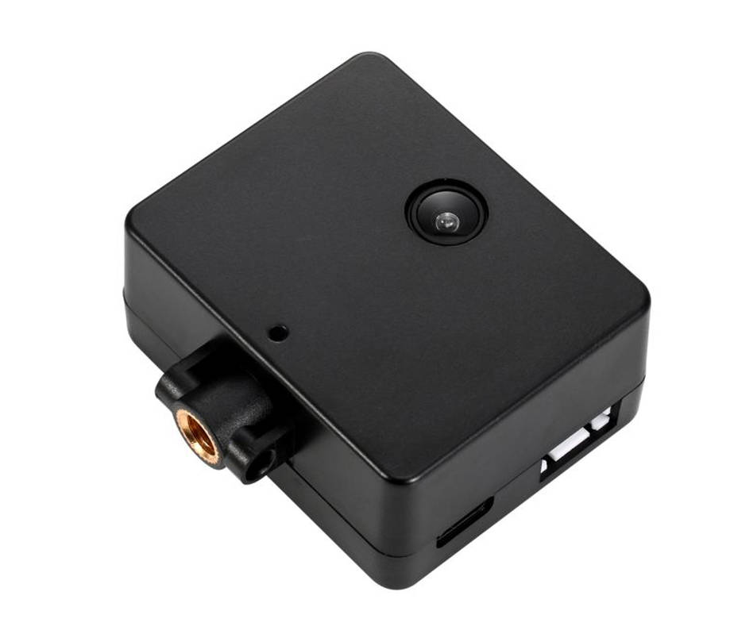
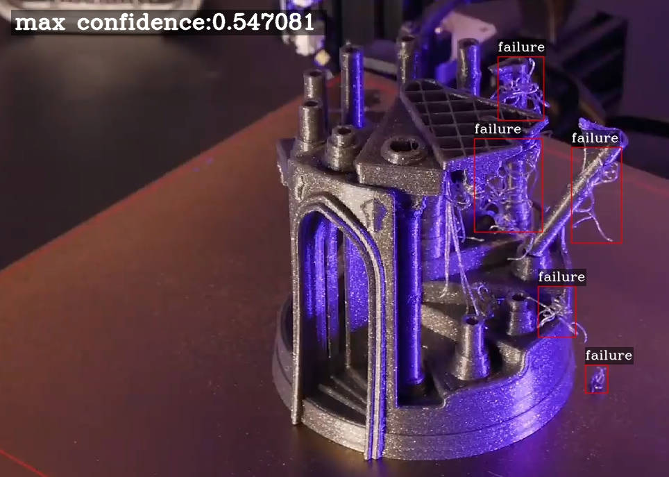
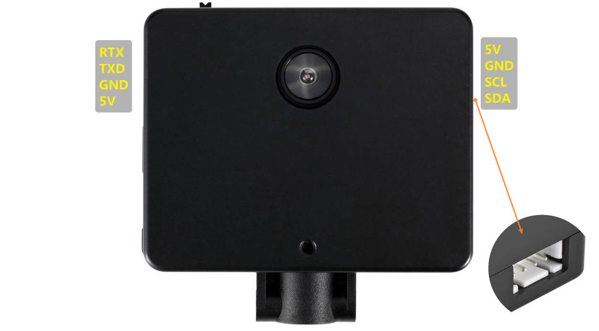

<p align="center"></p>

<h1 align="center">Sentry Pro</h1>
<p align="center">
  
   
</p>


## 1. Project catalog description

- Dependencies: Espressif System 1.0.6

## 2. Sentry Pro Introduction

Sentry works by sending pictures of your prints to a local computer, where a machine-learning algorithm is used to detect print issues and signs of potential fires. If Sentry identifies potential problems, it can notify users with images and warning messages. By running locally, there is no subscription fee, and minimizes network load. Sentry is also more secured and robust as the images are not shared externally to 3rd party cloud platform.

<div align=center>

</div>

**Key features:**
- Auto-detect potential print issues by - spotting errant extrusions Email notification
- 120-degree viewing angle camera
- Expand functions with UART and I2C ports
- Custom printable camera arm for Ender 3 and MK3S
- Custom printable camera case with tripod mount

**Resolution and Frame Rate**

- AI detection frame rate: 10 detections per minute
- 1200x720: 5fps
- 1024x768: 8fps
- 800x600: 15fps
- 640x480: 20fps

**Router Support**

- Sentry cannot connect to Google wifi series and Eero series routers, if you are a user of these two routers, please purchase carefully temporarily.
- Sentry Pro only support 2.4Gwifi

<div align=center>

</div>

## 3.Sentry Pro Web API

Please refer [this link](https://github.com/fiberpunk1/SentryAPI)

## 4.How to compile and update firmware


- Please refer this [guide](https://docs.google.com/document/d/1nrXws8Kn6kyR-FUqMdOn-QdA-vBN1T6YTApFDrN4fQs/edit?usp=sharing) to compile your own firmwre.

- Please refer to this [guide](https://docs.google.com/presentation/d/1qZ8EWYrk1U0yoJm6CzLRJAvI64quz03OszUj8OcOETM/edit?usp=sharing) to complete the firmware burning and updating.
## 5. Expansion port description

<div align=center>

</div>

example
```c++
//Sentry Uart
Serial.begin(115200);
Serial.println("fiberpunk");

```

## 6. Community support

- Email: contact@fiber-punk.com
- [Website](https://fiber-punk.com/)
- [Facebook](https://www.facebook.com/Fiberpunk-103588222263591)
- [Discord](https://discord.gg/VNNFrfhsbN)